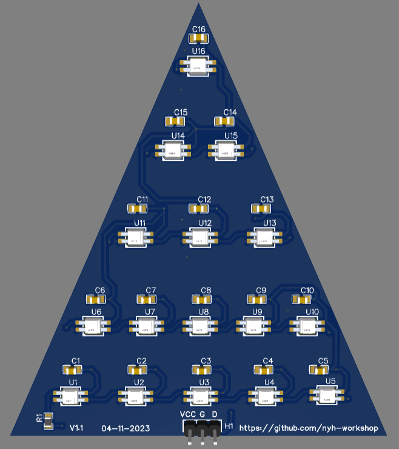
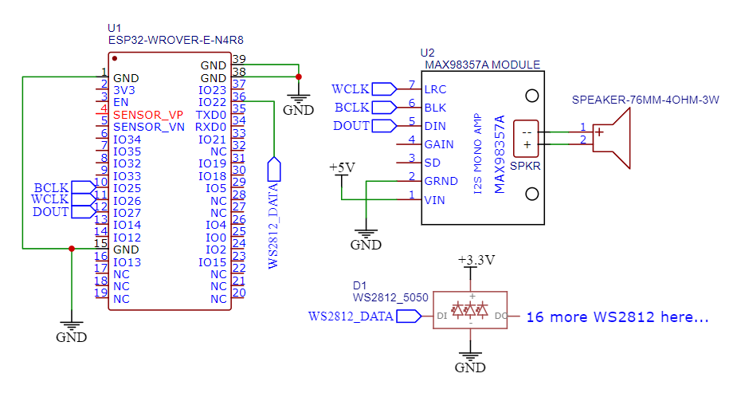

# xmas_883_2023

This is an improvisation of the "xmas" project (page 883) from Myke Predko's *Programming and Customizing the PIC Microcontroller*.

Originally, the decoration features wood pieces as Christmas tree (one triangle, and one base), with 16 LEDs tied to flip-flops (74HC374, acting as a shift register), and playing Christmas tunes with square-waves. The microcontroller involved was a PIC16F84.

In this improvisation, an ESP32 module is used as a replacement for PIC16F84, and 16 WS2812/SK6812 addressable LEDs, and the combination of Marcel Licence's [ML_SynthTools](https://github.com/marcel-licence/ML_SynthTools) and [ml_epiano_example](https://github.com/marcel-licence/ml_epiano_example) to play Christmas tunes.

## Requirements
- ESP32 module
- 16 WS2812/SK6812 addressable LEDs
- Arduino with ESP32 Arduino Core
- ESP32 Sketch Data Upload Plugin
- Adafruit MAX98357 module
- 4 ohm speaker
- Jumper wires

## LEDs
The addressable LEDs are powered by FastLED library. The core0 is running the LEDs task. The patterns are obtained from the official FastLED examples.

## Tree
Instead of wood pieces, the tree is entirely 3d-printed for convenience. For the 3d-print color, the "tree" is normally "Forest Green" and the base is a "wood brown".

If you need to have the addressable LEDs (as they are all SMDs) to sit on the triangle part of the tree, you can draw the tree by using a PCB service such as EasyEDA and then send it for fabrication with a low price.

Here is an example of the tree part with these LEDs:


## Modification of ML_SynthTools for *MidiStreamPlayer_Tick*
Due to the main app checking whether it is playing the MIDI file or not, some modifications must be performed at `midi_stream_player.h`. This file is located in `Documents\Arduino\libraries\ML_SynthTools-1.1.0\src`.

Replace instances of *MidiStreamPlayer_Tick* with this:
```
bool MidiStreamPlayer_Tick(uint32_t ticks);

bool MidiStreamPlayer_Tick(uint32_t ticks)
{
    if (midiPlaying == false)
    {
        if (midiAutoLoop)
        {
            /*
             * this will cause an audible noise for a short moment
             * seeking within files is very slow
             *
             * a new method is required to avoid this problem for better looping
             */
            MidiStreamRewind(&midiStreamPlayerHandle);
            long shortDuration;
            midiPlaying = MidiStreamReadSingleEventTime(&midiStreamPlayerHandle, &shortDuration);
            duration = shortDuration;
            duration *= SAMPLE_RATE;
            duration *= midiStreamPlayerHandle.midi_tempo;
        }
    }

    if (midiPlaying)
    {
        uint64_t longTick = ticks;
        longTick *= (uint64_t)interpret_uint16(midiStreamPlayerHandle.division_type_and_resolution);
        longTick *= 1000000;
        tickCnt += longTick;

        while ((tickCnt > duration) && midiPlaying)
        {
            tickCnt -= duration;

            midiPlaying &= MidiStreamReadSingleEvent(&midiStreamPlayerHandle);

            long shortDuration;
            midiPlaying &= MidiStreamReadSingleEventTime(&midiStreamPlayerHandle, &shortDuration);
            duration = shortDuration;
            duration *= SAMPLE_RATE;
            duration *= midiStreamPlayerHandle.midi_tempo;
        }
    }
	
	return midiPlaying;
}
```

## Tune player
Due to copyright reasons, the midi files are not included. As the book suggested, beginner's piano book with Christmas music is pretty ideal if you need to make a MIDI, or otherwise hunt for the piano MIDI files online.

The MIDI format recommended is **MIDI Format 0**. To convert these to MIDI Format 0, you can use apps like [Anvil Studio](https://www.anvilstudio.com/).

It is also required to use the **ESP32 Sketch Data Upload** to put the MIDI files inside the ESP32's flash.

Instructions:
```
First of all, create the 'data' folder in the project folder. 

1. Copy the *.mid files into the 'data' folder inside the project.

2. Then select Tools->ESP32 Sketch Data Upload, and then "LittleFS" inside. Press OK and it will upload these files into the flash.

3. Reboot the ESP32 module to start playing the MIDI files.
```

The tune player plays all the files at the core1 and then waits with a blinking LED at pin 23 after playing.

## Schematic

